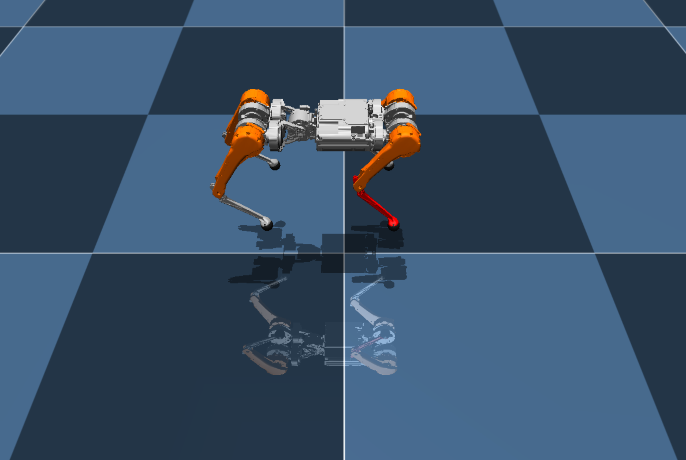
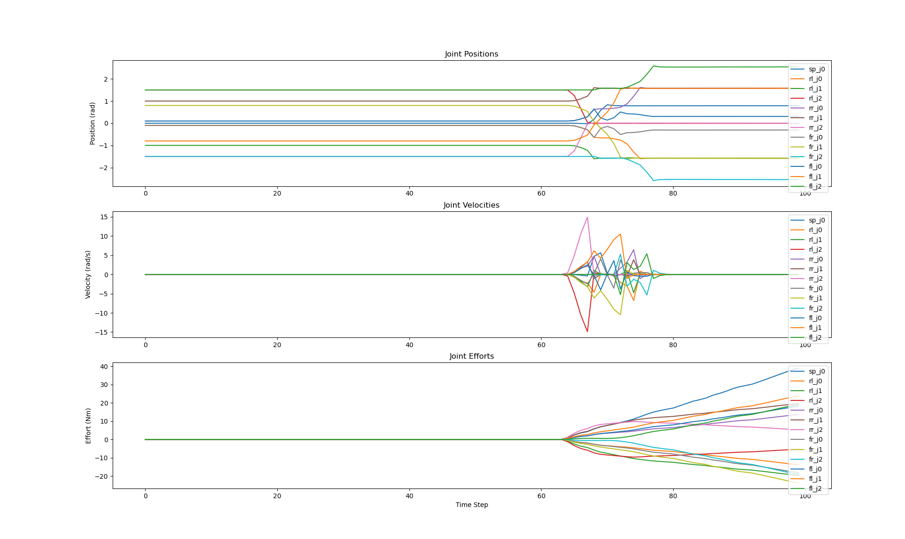

# Contact Estimation Testbed
Testbed for MAB quadruped contact estimation.




The package loads a floating quadruped with zero gravity and ROS2 `WrenchStamped` wrenches can be applied on each of the 4 feet
through topics:

```
/front_left_foot/wrench
/front_right_foot/wrench
/rear_left_foot/wrench
/rear_right_foot/wrench
```


## Requirements
This package uses [mujoco](https://mujoco.org/). Install it with

```bash
pip install -r requirements.txt
```

## Run
To launch the testbed, run

```bash
ros2 launch contact_estimation_testbed testbed.launch.py
```

To apply demo wrenches run
```bash
ros2 run apply_wrench apply_wrench
```

## Plotting
The joint states of the robot (position, velocity, effort) are published on the `/joint_states` topic and can be plotted using the plotter which dispplays the values real-time, and saves the file after the node is killed.




If specific joints, or specific measurements need to be plotted they can be plotted by commenting out lines in the [`plotter.yaml`](plot_joint_states/config/plotter.yaml). 


```yaml
joints:
  - fr_j0
  - fr_j1
  - fr_j2
  - fl_j0
  - fl_j1
  - fl_j2
  - rl_j0
  - rl_j1
  - rl_j2
  - rr_j0
  - rr_j1
  - rr_j2
  - sp_j0

plots:
  - position
  - velocity
  - effort
```
